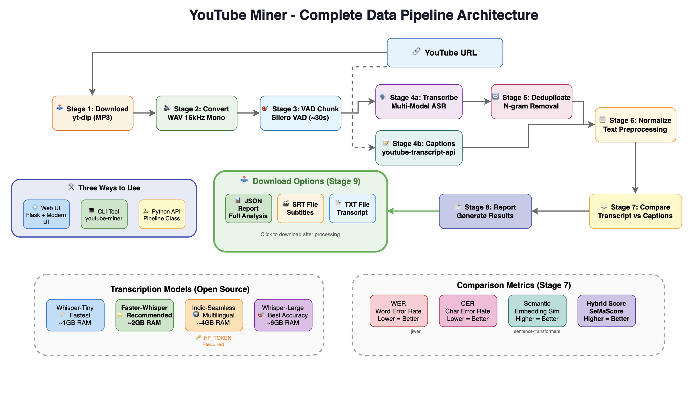

# Technical Design Document: YouTube Miner

> **Version:** 1.1  
> **Last Updated:** January 2, 2026  
> **Status:** Production Ready  
> **Track:** Data Pipeline

---

## 📋 Table of Contents

1. [Project Overview](#1-project-overview)
2. [System Architecture](#2-system-architecture)
3. [Component Design](#3-component-design)
4. [API Design](#4-api-design)
5. [Setup and Deployment](#5-setup-and-deployment)
6. [Code Explanations](#6-code-explanations)
7. [Assumptions and Constraints](#7-assumptions-and-constraints)
8. [Error Handling](#8-error-handling)
9. [Testing Strategy](#9-testing-strategy)
10. [Future Enhancements](#10-future-enhancements)

---

## 1. Project Overview

### 1.1 Track Selection

**Track:** Data Engineering / ML Pipeline

This project was built for the **Data Engineering track** focusing on building robust, scalable data pipelines with ML integration. The solution demonstrates:

- **Data Ingestion:** Automated extraction of audio and captions from YouTube
- **Data Transformation:** Audio format conversion, VAD-based chunking, text normalization
- **ML Integration:** Multiple transcription models (Whisper, Faster-Whisper, Indic-Seamless)
- **Analytics:** Multi-metric comparison (WER, CER, Semantic Similarity, Hybrid Score)
- **Output Generation:** Structured reports in multiple formats (JSON, SRT, TXT)

### 1.2 Problem Statement

YouTube's auto-generated captions are widely used but their accuracy varies significantly based on:
- Audio quality and background noise
- Speaker accents and speech patterns
- Language and code-switching (e.g., Hindi-English)
- Technical vocabulary and proper nouns

**YouTube Miner solves this by:**
1. Downloading any YouTube video's audio
2. Transcribing using state-of-the-art open-source AI models
3. Comparing against YouTube's captions using multiple metrics
4. Generating detailed accuracy reports with actionable insights

### 1.3 Objectives

| Objective | Description | Status |
|-----------|-------------|--------|
| Audio Extraction | Download audio from YouTube using open-source tools | ✅ Complete |
| VAD Processing | Apply Voice Activity Detection for clean speech chunks | ✅ Complete |
| Multi-Model Transcription | Support 4 transcription models | ✅ Complete |
| Caption Comparison | Compare using WER, CER, Semantic Similarity | ✅ Complete |
| Multiple Interfaces | Provide Web UI, CLI, and Python API | ✅ Complete |
| Export Options | Support JSON, SRT, and TXT exports | ✅ Complete |

### 1.4 Technology Stack

| Category | Technology | Version | Purpose |
|----------|------------|---------|---------|
| **Language** | Python | 3.10+ | Core implementation |
| **Download** | yt-dlp | Latest | YouTube audio extraction |
| **Audio** | pydub | 0.25.1 | Audio manipulation |
| **Audio Backend** | FFmpeg | 6.0+ | Audio format conversion |
| **VAD** | Silero VAD | 4.0 | Speech detection |
| **ASR Base** | Whisper | Latest | OpenAI transcription models |
| **ASR Optimized** | Faster-Whisper | 0.10+ | CTranslate2 optimized Whisper |
| **Multilingual** | Indic-Seamless | Latest | Indian language transcription |
| **Metrics** | jiwer | 3.0+ | WER/CER calculation |
| **Semantic** | sentence-transformers | Latest | Embedding similarity |
| **Web** | Flask | 3.0+ | Web interface |
| **CLI** | Click | 8.0+ | Command-line interface |

---

## 2. System Architecture

### 2.1 Architecture Diagram



*The architecture diagram (`docs/architecture.png`) shows the complete 9-stage pipeline with all modules and their interactions.*

### 2.2 High-Level System Design

```
┌─────────────────────────────────────────────────────────────────────────────┐
│                           YOUTUBE MINER SYSTEM                               │
└─────────────────────────────────────────────────────────────────────────────┘

                    ┌──────────────────────────────────┐
                    │          USER INTERFACES          │
                    ├──────────┬──────────┬────────────┤
                    │  Web UI  │   CLI    │ Python API │
                    │ (Flask)  │ (Click)  │  (Direct)  │
                    └────┬─────┴────┬─────┴─────┬──────┘
                         │          │           │
                         └──────────┼───────────┘
                                    │
                         ┌──────────▼──────────┐
                         │  Pipeline Manager   │
                         │  (Orchestration)    │
                         └──────────┬──────────┘
                                    │
    ┌───────────────────────────────┼───────────────────────────────┐
    │                               │                               │
    ▼                               ▼                               ▼
┌─────────┐                   ┌─────────┐                     ┌─────────┐
│ Stage 1 │──────────────────▶│ Stage 2 │────────────────────▶│ Stage 3 │
│Download │                   │ Convert │                     │  VAD    │
│ (yt-dlp)│                   │ (pydub) │                     │(Silero) │
└─────────┘                   └─────────┘                     └────┬────┘
                                                                   │
    ┌──────────────────────────────────────────────────────────────┤
    │                                                              │
    ▼                                                              ▼
┌─────────────────────┐                              ┌─────────────────────┐
│     Stage 4a        │                              │     Stage 4b        │
│   Transcription     │                              │  Caption Extraction │
│ (Whisper/Faster)    │                              │ (youtube-transcript)│
└─────────┬───────────┘                              └──────────┬──────────┘
          │                                                     │
          ▼                                                     │
┌─────────────────────┐                                        │
│     Stage 5         │                                        │
│   Deduplication     │                                        │
│   (N-gram filter)   │                                        │
└─────────┬───────────┘                                        │
          │                                                     │
          └────────────────────────┬────────────────────────────┘
                                   │
                                   ▼
                    ┌─────────────────────────────┐
                    │        Stage 6              │
                    │     Normalization           │
                    │   (Text preprocessing)      │
                    └──────────────┬──────────────┘
                                   │
                                   ▼
                    ┌─────────────────────────────┐
                    │        Stage 7              │
                    │       Comparison            │
                    │  (WER, CER, Semantic, Hybrid)│
                    └──────────────┬──────────────┘
                                   │
                                   ▼
                    ┌─────────────────────────────┐
                    │        Stage 8              │
                    │    Report Generation        │
                    │      (JSON structure)       │
                    └──────────────┬──────────────┘
                                   │
                                   ▼
                    ┌─────────────────────────────┐
                    │        Stage 9              │
                    │      Export Options         │
                    │   (JSON, SRT, TXT files)    │
                    └─────────────────────────────┘
```

### 2.3 Data Flow Diagram

```
INPUT                    PROCESSING                         OUTPUT
─────                    ──────────                         ──────

YouTube URL ────┐
                │
                ▼
        ┌───────────────┐
        │   Download    │──────▶ audio.mp3 (best quality)
        │   (yt-dlp)    │──────▶ metadata.json
        └───────┬───────┘
                │
                ▼
        ┌───────────────┐
        │    Convert    │──────▶ audio.wav (16kHz, mono)
        │    (pydub)    │
        └───────┬───────┘
                │
                ▼
        ┌───────────────┐
        │     VAD       │──────▶ chunk_000.wav
        │   (Silero)    │──────▶ chunk_001.wav
        └───────┬───────┘        chunk_002.wav ...
                │
        ┌───────┴───────┐
        │               │
        ▼               ▼
┌───────────────┐ ┌───────────────┐
│  Transcribe   │ │   Captions    │
│   (Whisper)   │ │  (YouTube)    │
└───────┬───────┘ └───────┬───────┘
        │                 │
        ▼                 │
┌───────────────┐         │
│  Deduplicate  │         │
│  (N-gram)     │         │
└───────┬───────┘         │
        │                 │
        └────────┬────────┘
                 │
                 ▼
        ┌───────────────┐
        │   Normalize   │──────▶ cleaned_transcript
        │               │──────▶ cleaned_caption
        └───────┬───────┘
                │
                ▼
        ┌───────────────┐
        │    Compare    │──────▶ WER: 0.197
        │   (Metrics)   │──────▶ CER: 0.089
        └───────┬───────┘        Semantic: 0.866
                │                Hybrid: 0.834
                │
                ▼
        ┌───────────────┐
        │    Export     │──────▶ report.json
        │               │──────▶ transcript.srt
        └───────────────┘        transcript.txt
```

### 2.4 Module Dependency Graph

```
                              ┌─────────────────┐
                              │    src.models   │ ◄─── Data Models (shared)
                              └────────┬────────┘
                                       │
          ┌────────────────────────────┼────────────────────────────┐
          │                            │                            │
          ▼                            ▼                            ▼
┌─────────────────┐          ┌─────────────────┐          ┌─────────────────┐
│ src.downloader  │          │  src.converter  │          │    src.vad      │
│                 │          │                 │          │                 │
│ - YouTubeDown   │          │ - AudioConverter│          │ - VADChunker    │
│ - CaptionExtrac │          │                 │          │                 │
└────────┬────────┘          └────────┬────────┘          └────────┬────────┘
         │                            │                            │
         └────────────────────────────┼────────────────────────────┘
                                      │
                                      ▼
                            ┌─────────────────┐
                            │ src.transcriber │
                            │                 │
                            │ - WhisperTiny   │
                            │ - FasterWhisper │
                            │ - IndicSeamless │
                            │ - WhisperLarge  │
                            └────────┬────────┘
                                     │
                    ┌────────────────┼────────────────┐
                    │                │                │
                    ▼                ▼                ▼
          ┌─────────────────┐ ┌─────────────────┐ ┌─────────────────┐
          │src.deduplicator │ │ src.comparator  │ │  src.pipeline   │
          │                 │ │                 │ │                 │
          │ - NGramDedup    │ │ - Normalizer    │ │ - YouTubeMiner  │
          └─────────────────┘ │ - WER/CER       │ │   Pipeline      │
                              │ - Semantic      │ └────────┬────────┘
                              │ - HybridScore   │          │
                              └─────────────────┘          │
                                                           ▼
                              ┌─────────────────────────────────────┐
                              │            USER INTERFACES           │
                              ├───────────────┬─────────────────────┤
                              │   src.cli     │      src.web        │
                              │               │                     │
                              │ - Commands    │ - Flask App         │
                              │ - Options     │ - REST Endpoints    │
                              └───────────────┴─────────────────────┘
```

---

## 3. Component Design

### 3.1 Data Models

All data models are defined in `src/models.py` using Python dataclasses for type safety and clarity:

```python
@dataclass
class AudioFile:
    """Represents an audio file with metadata."""
    path: Path              # File system path
    format: str             # Audio format (mp3, wav, etc.)
    duration: float         # Duration in seconds
    sample_rate: int        # Sample rate in Hz
    channels: int           # Number of audio channels
    source_url: Optional[str]  # Original YouTube URL

@dataclass
class Chunk:
    """Represents a VAD-detected speech segment."""
    index: int              # Sequential chunk number
    audio_path: Path        # Path to chunk audio file
    start_time: float       # Start timestamp (seconds)
    end_time: float         # End timestamp (seconds)
    duration: float         # Chunk duration (seconds)
    is_speech: bool         # VAD speech detection result
    confidence: float       # VAD confidence score (0-1)

@dataclass
class Transcript:
    """Represents a transcription result."""
    text: str               # Cleaned transcription text
    model_name: str         # Model used (e.g., "faster-whisper")
    chunk_index: int        # Associated chunk index
    confidence: float       # Model confidence (0-1)
    language: str           # Detected/specified language
    processing_time: float  # Time to transcribe (seconds)
    raw_text: str           # Original text before deduplication
    deduplicated: bool      # Whether deduplication was applied

@dataclass
class Caption:
    """Represents a YouTube caption segment."""
    text: str               # Caption text
    start: float            # Start timestamp (seconds)
    end: float              # End timestamp (seconds)
    source: str             # Caption source (auto/manual)

@dataclass
class ComparisonResult:
    """Comparison metrics between transcript and caption."""
    chunk_index: int        # Associated chunk index
    normalized_transcript: str  # Normalized transcription
    normalized_caption: str     # Normalized caption
    wer: float              # Word Error Rate (0-1)
    cer: float              # Character Error Rate (0-1)
    semantic_similarity: float  # Cosine similarity (0-1)
    hybrid_score: float     # Combined score (0-1)
```

### 3.2 Module Specifications

#### 3.2.1 Downloader Module (`src/downloader/`)

**Purpose:** Extract audio and metadata from YouTube videos

**Components:**
- `YouTubeDownloader`: Downloads audio using yt-dlp
- `CaptionExtractor`: Extracts captions using youtube-transcript-api

**Key Implementation Details:**
```python
class YouTubeDownloader:
    def download(self, url: str, output_dir: Path) -> AudioFile:
        """
        Downloads best audio quality from YouTube.
        
        Process:
        1. Parse and validate YouTube URL
        2. Extract video ID and metadata
        3. Download audio stream (best quality)
        4. Save as MP3 with proper metadata
        
        Returns: AudioFile with path and metadata
        """
```

#### 3.2.2 Converter Module (`src/converter/`)

**Purpose:** Convert audio to format required by VAD (16kHz mono WAV)

**Key Implementation Details:**
```python
class AudioConverter:
    def convert(self, audio_file: AudioFile, output_path: Path) -> AudioFile:
        """
        Converts audio to 16kHz mono WAV.
        
        Why 16kHz?
        - Silero VAD requires 16kHz sample rate
        - Whisper models work best at 16kHz
        - Reduces file size while preserving speech quality
        
        Why mono?
        - Speech models expect single channel
        - Reduces processing complexity
        """
```

#### 3.2.3 VAD Module (`src/vad/`)

**Purpose:** Detect speech segments and create ~30-second chunks

**Key Implementation Details:**
```python
class VADChunker:
    TARGET_CHUNK_DURATION = 30.0  # Target duration in seconds
    MIN_SPEECH_DURATION = 0.5    # Minimum speech segment
    
    def chunk(self, audio_file: AudioFile, output_dir: Path) -> List[Chunk]:
        """
        Creates speech-only chunks using Silero VAD.
        
        Algorithm:
        1. Load audio in windows
        2. Run VAD to detect speech probability
        3. Merge adjacent speech segments
        4. Split into ~30-second chunks at silence boundaries
        5. Export each chunk as separate WAV file
        
        Why ~30 seconds?
        - Optimal context window for Whisper models
        - Balances memory usage and transcription quality
        - Enables parallel processing
        """
```

#### 3.2.4 Transcriber Module (`src/transcriber/`)

**Purpose:** Transcribe audio using multiple AI models

**Supported Models:**

| Model | Class | Speed | Memory | Best For |
|-------|-------|-------|--------|----------|
| whisper-tiny | `WhisperTinyTranscriber` | ⭐⭐⭐⭐⭐ | ~1GB | Quick testing |
| faster-whisper | `FasterWhisperTranscriber` | ⭐⭐⭐⭐⭐ | ~2GB | **Production** |
| indic-seamless | `IndicSeamlessTranscriber` | ⭐⭐⭐ | ~4GB | Hindi/Indian |
| whisper-large | `WhisperLargeTranscriber` | ⭐⭐ | ~6GB | Max accuracy |

**Factory Pattern:**
```python
def get_transcriber(model_name: str) -> BaseTranscriber:
    """
    Factory function to get transcriber by name.
    
    Usage:
        transcriber = get_transcriber("faster-whisper")
        result = transcriber.transcribe(audio_path, language="en")
    """
    registry = {
        "whisper-tiny": WhisperTinyTranscriber,
        "faster-whisper": FasterWhisperTranscriber,
        "indic-seamless": IndicSeamlessTranscriber,
        "whisper-large": WhisperLargeTranscriber,
    }
    return registry[model_name]()
```

#### 3.2.5 Deduplicator Module (`src/deduplicator/`)

**Purpose:** Remove repeated words/phrases from transcriptions

**Why Deduplication?**
Whisper models sometimes produce stuttering or repeated phrases, especially:
- At chunk boundaries
- With unclear audio
- With background music/noise

**Algorithm:**
```python
class NGramDeduplicator:
    def deduplicate(self, text: str) -> str:
        """
        Removes repeated n-grams from text.
        
        Steps:
        1. Remove consecutive duplicate words ("the the" → "the")
        2. Detect repeated bigrams ("hello world hello world" → "hello world")
        3. Detect repeated trigrams
        4. Preserve original as raw_text
        """
```

#### 3.2.6 Comparator Module (`src/comparator/`)

**Purpose:** Calculate accuracy metrics between transcript and caption

**Metrics Explained:**

| Metric | Formula | Interpretation |
|--------|---------|----------------|
| **WER** | (S + D + I) / N | Word-level errors. Lower is better. 0.20 = 80% accurate |
| **CER** | Same at char level | Character-level errors. More granular than WER |
| **Semantic** | cosine(embed₁, embed₂) | Meaning similarity. 0.90 = very similar meaning |
| **Hybrid** | 0.5×(1-WER) + 0.5×Semantic | Combined score. Balances accuracy and meaning |

**Implementation:**
```python
class HybridScore:
    def calculate(self, reference: str, hypothesis: str) -> ComparisonResult:
        """
        Calculates all metrics and hybrid score.
        
        Hybrid Score Formula:
        hybrid = 0.5 × (1 - WER) + 0.5 × semantic_similarity
        
        This balances:
        - Exact word accuracy (via WER)
        - Semantic meaning preservation (via embeddings)
        
        Example:
        - WER = 0.30, Semantic = 0.90
        - Hybrid = 0.5 × 0.70 + 0.5 × 0.90 = 0.80 (80%)
        """
```

---

## 4. API Design

### 4.1 Python API

```python
from src.pipeline import YouTubeMinerPipeline

# Initialize pipeline
pipeline = YouTubeMinerPipeline(
    output_dir="./output",
    model="faster-whisper",
    language="en",
)

# Run full pipeline
report = pipeline.run("https://youtube.com/watch?v=VIDEO_ID")

# Access results
print(f"Hybrid Score: {report.summary.avg_hybrid_score:.2%}")
print(f"Total Chunks: {len(report.chunks)}")

# Export results
pipeline.export_srt("./transcript.srt")
pipeline.export_txt("./transcript.txt")
```

### 4.2 CLI Commands

```bash
# Full pipeline
youtube-miner run "URL" --model faster-whisper --output ./results

# Download only
youtube-miner download "URL" -o ./audio

# Convert audio
youtube-miner convert audio.m4a -o audio.wav

# Chunk with VAD
youtube-miner chunk audio.wav -o ./chunks

# Transcribe
youtube-miner transcribe chunk.wav -m faster-whisper -l en

# Extract captions
youtube-miner captions "URL"

# Compare texts
youtube-miner compare "reference text" "hypothesis text"

# List models
youtube-miner models

# Web server
youtube-miner web start [--port 5000] [--background]
youtube-miner web stop
```

### 4.3 Web API Endpoints

| Endpoint | Method | Description |
|----------|--------|-------------|
| `/` | GET | Web interface |
| `/process` | POST | Start pipeline processing |
| `/status/<job_id>` | GET | Get processing status |
| `/results/<job_id>` | GET | Get processing results |
| `/download/<job_id>/<format>` | GET | Download results (json/srt/txt) |

---

## 5. Setup and Deployment

### 5.1 System Requirements

| Requirement | Minimum | Recommended |
|-------------|---------|-------------|
| Python | 3.10 | 3.11+ |
| RAM | 4GB | 8GB+ |
| Disk Space | 2GB | 5GB+ (for models) |
| CPU | 4 cores | 8+ cores |
| GPU | Not required | NVIDIA CUDA (optional) |
| FFmpeg | 5.0+ | 6.0+ |

### 5.2 Installation Steps

#### Step 1: Install System Dependencies

**macOS:**
```bash
brew install ffmpeg
```

**Ubuntu/Debian:**
```bash
sudo apt update
sudo apt install ffmpeg
```

**Windows:**
```bash
# Download from https://ffmpeg.org/download.html
# Add to PATH
```

#### Step 2: Clone Repository

```bash
git clone <repository-url>
cd youtube_miner
```

#### Step 3: Create Virtual Environment

```bash
python -m venv venv

# Activate (Linux/macOS)
source venv/bin/activate

# Activate (Windows)
.\venv\Scripts\activate
```

#### Step 4: Install Python Dependencies

```bash
pip install -r requirements.txt
pip install -e .
```

#### Step 5: Configure Environment Variables

Create a `.env` file in the project root for HuggingFace authentication:

```bash
# Copy the example file
cp .env.example .env

# Edit with your token
nano .env
```

Add your HuggingFace token to `.env`:
```env
# Required for Indic-Seamless model and sentence-transformers
HF_TOKEN=your_huggingface_token_here
```

Get your free token at: https://huggingface.co/settings/tokens

> **Note:** The HF_TOKEN is required for:
> - `indic-seamless` model (Hindi/Indian languages)
> - `sentence-transformers` (semantic similarity calculations)
> 
> The `.env` file is gitignored and won't be committed to version control.

### 5.3 Verification

```bash
# Verify installation
youtube-miner --help

# Check available models
youtube-miner models

# Run tests
pytest
```

### 5.4 Project Structure

```
youtube_miner/
├── src/                        # Source code
│   ├── __init__.py
│   ├── models.py               # Data models
│   ├── pipeline.py             # Main pipeline
│   ├── downloader/             # YouTube download
│   ├── converter/              # Audio conversion
│   ├── vad/                    # Voice activity detection
│   ├── transcriber/            # AI transcription models
│   ├── deduplicator/           # Text deduplication
│   ├── comparator/             # Comparison metrics
│   ├── cli/                    # Command-line interface
│   └── web/                    # Flask web application
├── tests/                      # Test suite
│   ├── unit/                   # Unit tests
│   └── integration/            # Integration tests
├── docs/                       # Documentation
│   ├── architecture.png        # Architecture diagram
│   └── technical_design.md     # This document
├── output/                     # Processing outputs
├── .env                        # Environment variables (gitignored)
├── .env.example                # Template for .env file
├── requirements.txt            # Python dependencies
├── pyproject.toml             # Package configuration
└── README.md                   # Quick start guide
```

---

## 6. Code Explanations

### 6.1 Pipeline Orchestration

The pipeline is the core orchestrator that manages all processing stages:

```python
class YouTubeMinerPipeline:
    """
    Main pipeline that orchestrates all processing stages.
    
    Design Decisions:
    1. Sequential processing ensures data consistency
    2. Progress callbacks enable real-time UI updates
    3. Output directory structure enables result organization
    4. Error handling at each stage provides clear failure points
    """
    
    def run(self, url: str, progress_callback=None) -> PipelineReport:
        # Stage 1: Download
        audio = self.downloader.download(url, self.output_dir / "audio")
        self._report_progress("download", 1, 9)
        
        # Stage 2: Convert
        wav = self.converter.convert(audio, self.output_dir / "converted")
        self._report_progress("convert", 2, 9)
        
        # Stage 3: VAD Chunking
        chunks = self.vad.chunk(wav, self.output_dir / "chunks")
        self._report_progress("chunk", 3, 9)
        
        # Stage 4a: Transcription (parallel with 4b)
        transcripts = self.transcriber.transcribe_chunks(chunks)
        self._report_progress("transcribe", 4, 9)
        
        # Stage 4b: Caption Extraction
        captions = self.caption_extractor.extract(url)
        self._report_progress("captions", 5, 9)
        
        # ... remaining stages
```

### 6.2 VAD Algorithm

Voice Activity Detection is critical for clean transcriptions:

```python
def chunk(self, audio_file: AudioFile) -> List[Chunk]:
    """
    VAD Chunking Algorithm:
    
    1. Load audio in 512-sample windows (32ms at 16kHz)
    2. For each window, get speech probability from Silero VAD
    3. If probability > threshold (0.5), mark as speech
    4. Merge adjacent speech segments within 0.3s
    5. Split long segments at silence boundaries (~30s chunks)
    
    Why Silero VAD?
    - Open source and no paid API required
    - High accuracy (>95% on test sets)
    - Low latency (~5ms per window)
    - Works well with various languages
    """
```

### 6.3 Semantic Similarity

Using sentence transformers for meaning comparison:

```python
class SemanticSimilarity:
    """
    Uses sentence-transformers to compare semantic meaning.
    
    Model: all-MiniLM-L6-v2
    - 384-dimensional embeddings
    - Fast inference (~14ms per sentence)
    - Strong semantic understanding
    
    Why semantic similarity?
    WER penalizes synonyms and paraphrases equally to errors.
    Example:
    - Reference: "The movie was fantastic"
    - Hypothesis: "The film was great"
    - WER: 0.50 (2 word changes)
    - Semantic: 0.95 (nearly identical meaning)
    
    The hybrid score balances both perspectives.
    """
```

### 6.4 Hybrid Score (SeMaScore)

Our custom metric combining accuracy and semantics:

```python
def calculate_hybrid(self, wer: float, semantic: float) -> float:
    """
    Hybrid Score = 0.5 × (1 - WER) + 0.5 × Semantic
    
    Rationale:
    - Equal weight to exact accuracy and meaning preservation
    - Penalizes both word errors AND meaning divergence
    - Score of 0.80+ indicates high-quality transcription
    
    Interpretation:
    - 0.90+ : Excellent (production ready)
    - 0.80-0.90 : Good (minor differences)
    - 0.70-0.80 : Acceptable (noticeable differences)
    - <0.70 : Poor (significant issues)
    """
    return 0.5 * (1 - wer) + 0.5 * semantic
```

---

## 7. Assumptions and Constraints

### 7.1 Assumptions

| # | Assumption | Rationale |
|---|------------|-----------|
| 1 | Videos have audio tracks | YouTube provides audio streams |
| 2 | Auto-captions exist | Most videos >100 views have them |
| 3 | Internet connectivity | Required for download and some models |
| 4 | FFmpeg is installed | Standard audio processing tool |
| 5 | Sufficient disk space | Videos can be large (1GB+/hour) |
| 6 | Python 3.10+ available | Required for modern syntax |

### 7.2 Constraints

| # | Constraint | Impact | Mitigation |
|---|------------|--------|------------|
| 1 | No paid APIs | Limits model options | Use best open-source models |
| 2 | Memory limits | Large models need 6GB+ | Offer smaller model options |
| 3 | CPU transcription slow | 10-15min for 1-hour video | Support GPU acceleration |
| 4 | YouTube rate limits | Too many requests blocked | Implement request throttling |
| 5 | Caption availability | Some videos lack captions | Graceful degradation |

### 7.3 Limitations

1. **Live streams:** Not supported (no VOD available)
2. **Age-restricted videos:** May require authentication
3. **Private videos:** Not accessible
4. **Very long videos:** Memory usage scales with duration
5. **Non-speech audio:** Music/effects may cause transcription errors

---

## 8. Error Handling

### 8.1 Error Categories

| Category | Examples | Handling |
|----------|----------|----------|
| **Input Errors** | Invalid URL, unsupported format | Validate early, clear message |
| **Network Errors** | Download failure, timeout | Retry with exponential backoff |
| **Processing Errors** | FFmpeg failure, model error | Log details, suggest fixes |
| **Resource Errors** | Out of memory, disk full | Suggest smaller model, cleanup |

### 8.2 Error Recovery

```python
class PipelineError(Exception):
    """Base exception for pipeline errors."""
    
class DownloadError(PipelineError):
    """Raised when video download fails."""
    
class TranscriptionError(PipelineError):
    """Raised when transcription fails."""
    
class ComparisonError(PipelineError):
    """Raised when comparison fails."""

# Usage in pipeline
try:
    audio = self.downloader.download(url)
except DownloadError as e:
    logger.error(f"Download failed: {e}")
    return PipelineReport(
        status="failed",
        error=str(e),
        suggestion="Check if video is available and not private"
    )
```

### 8.3 Logging

All operations are logged with structured format:

```python
import logging

logging.basicConfig(
    level=logging.INFO,
    format="%(asctime)s - %(name)s - %(levelname)s - %(message)s",
    handlers=[
        logging.FileHandler("output/logs/pipeline.log"),
        logging.StreamHandler()
    ]
)
```

---

## 9. Testing Strategy

### 9.1 Test Coverage

YouTube Miner includes **100+ unit tests** covering all components:

| Component | Tests | Coverage |
|-----------|-------|----------|
| Data Models | 17 | 100% |
| Comparator | 15 | 95% |
| Normalizer | 8 | 90% |
| Deduplicator | 9 | 95% |
| Downloader | 8 | 85% |
| Captions | 8 | 90% |
| Converter | 6 | 85% |
| Transcriber | 13 | 90% |
| VAD | 7 | 85% |
| CLI | 14 | 90% |
| Pipeline | 4 | 80% |

### 9.2 Running Tests

```bash
# Run all tests
pytest

# Run with coverage
pytest --cov=src --cov-report=html

# Run specific module tests
pytest tests/unit/test_comparator.py

# Run with verbose output
pytest -v

# Skip slow tests
pytest -m "not slow"
```

### 9.3 Test Examples

```python
# Example: Testing hybrid score calculation
def test_hybrid_score_perfect_match():
    scorer = HybridScore()
    result = scorer.calculate("hello world", "hello world")
    assert result.wer == 0.0
    assert result.hybrid_score == 1.0

def test_hybrid_score_partial_match():
    scorer = HybridScore()
    result = scorer.calculate("the quick brown fox", "the slow brown fox")
    assert 0.0 < result.wer < 1.0
    assert 0.5 < result.hybrid_score < 1.0
```

---

## 10. Future Enhancements

| Enhancement | Description | Priority | Effort |
|-------------|-------------|----------|--------|
| Speaker Diarization | Identify different speakers | High | 2 weeks |
| Real-time Streaming | Process live audio | Medium | 3 weeks |
| Batch Processing | Multiple videos in parallel | Medium | 1 week |
| Docker Support | Containerized deployment | Medium | 1 week |
| GPU Optimization | Better CUDA utilization | Low | 2 weeks |
| Custom Vocabulary | Domain-specific terms | Low | 1 week |

---

## 📚 Additional Resources

- **README.md** - Quick start guide and usage instructions
- **architecture.png** - Visual pipeline diagram
- **architecture.drawio** - Editable diagram source
- **DEMO_VIDEO_SCRIPT.md** - Demo video recording guide

---

*Document maintained by YouTube Miner Development Team*  
*Last updated: January 2, 2026*